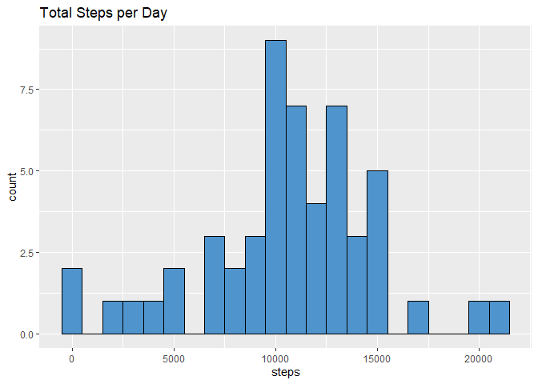
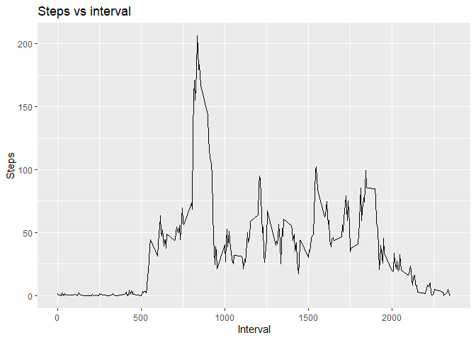
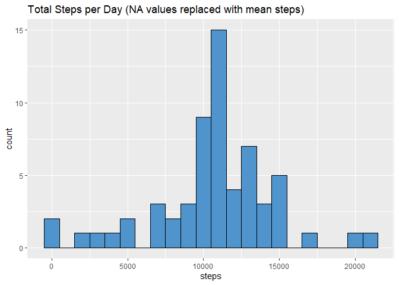
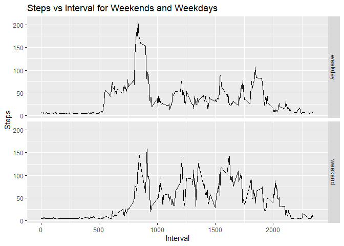

```r
library(ggplot2)
library(data.table)
```


```r
#steps: Number of steps taking in a 5-minute interval (missing #values are coded as NA)
#date: The date on which the measurement was taken in #YYYY-MM-DD format
#interval: Identifier for the 5-minute interval in which #measurement was taken


#Load data
activity_data <- read.csv("activity.csv", header = TRUE) |>
  na.omit() |>
  data.table()

#View(activity_data)
```


## Total steps per day


```r
#calculate total steps per day
activity_data_bydate <- aggregate(steps ~ date, activity_data, sum)

#histogram of the total steps taken each day
activity_hist <- ggplot(data = activity_data_bydate, aes(x = steps)) +
  geom_histogram(binwidth = 1000, color = "black", fill = "steelblue3") +
  ggtitle("Total Steps per Day") 
  
activity_hist
```

<!-- -->

## Mean and median total steps per day

### Mean steps per day

```r
#calculate mean and median total steps per day
mean(activity_data_bydate$steps)
```

```
## [1] 10766.19
```

### Median steps per day

```r
median(activity_data_bydate$steps)
```

```
## [1] 10765
```

## Time series plot (steps vs 5 minute interval)

```r
activity_timeseries <- aggregate(steps ~ interval, activity_data, mean )
activity_timeseries_plot <- ggplot(data = activity_timeseries, aes( x = interval, y = steps)) +
  geom_line() +
  ylab("Steps")+
  xlab("Interval")+
  ggtitle("Steps vs interval")

activity_timeseries_plot
```

<!-- -->

```r
#maximim steps
max_interval_steps <- max(activity_timeseries$steps)
#interval at maximum steps
activity_timeseries[activity_timeseries$steps == max(activity_timeseries$steps),]
```

```
##     interval    steps
## 104      835 206.1698
```

Maximum number of steps, 206.1698113, occurs during interval 835

## Impute missing values

```r
#dataset with NA's included
activity_data_NA <- read.csv("activity.csv", header = TRUE) |>
  data.table()
#View(activity_data_NA)
```


```r
#calculate total number of NA's
NAs <- sum(is.na(activity_data_NA))
#NAs
```

A total of 2304 missing values are present in the data set.


```r
#copy data
new_activity_data <- activity_data_NA |>
  data.table()
#assign mean to NAs
replace_NA <- function(x) replace(x, is.na(x), mean(x, na.rm = TRUE))
new_activity_data[] <- lapply(new_activity_data, replace_NA)
```

```
## Warning in mean.default(x, na.rm = TRUE): argument is not numeric or logical:
## returning NA
```

```r
#View(new_activity_data)
#sum(is.na(new_activity_data))
```


```r
#calculate total steps per day
new_activity_data_bydate <- aggregate(steps ~ date, new_activity_data, sum)

#histogram of the total steps taken each day
new_activity_hist <- ggplot(data = new_activity_data_bydate, aes(x = steps)) +
  geom_histogram(binwidth = 1000, color = "black", fill = "steelblue3") +
  ggtitle("Total Steps per Day (NA values replaced with mean steps)") 
  
new_activity_hist
```

<!-- -->

```r
#activity_hist
```

## Mean and median total steps per day: NA values replaced with mean number of steps

### Mean steps per day

```r
#calculate mean and median total steps per day
mean(new_activity_data_bydate$steps)
```

```
## [1] 10766.19
```

### Median steps per day

```r
median(new_activity_data_bydate$steps)
```

```
## [1] 10766.19
```
Previously, the mean and median were 10766.19 and 10765, respectively (essentially the same). 
Replacing all NA values with the column mean of number of steps did not change the data. New mean an median are equal to each other at 10766.19.

## Number of steps on weekdays vs weekends

```r
#create new factor variable with levels "weekday" and "weekend"
#new column with dates reformatted
new_activity_data$date <- as.Date(new_activity_data$date, format = "%Y-%m-%d")
#new column for weekdays
new_activity_data$weekday <- weekdays(new_activity_data$date)
#weekday or weekend?
new_activity_data$day <- ifelse(new_activity_data$weekday=='Saturday' | new_activity_data$weekday=='Sunday', 'weekend', 'weekday')


#mean steps per interval on weekends and weekdays
mean_weekday <- aggregate(steps ~ interval + day, data = new_activity_data,mean)
#make a panel plot with time series plots of average steps vs interval for weekday and weekend
```

```r
activity_timeseries_daytype_plot <- ggplot(data = mean_weekday, aes( x = interval, y = steps)) +
  geom_line() +
  ylab("Steps")+
  xlab("Interval")+
  ggtitle("Steps vs Interval for Weekends and Weekdays")+
  facet_grid(day ~ .)

activity_timeseries_daytype_plot
```

<!-- -->

