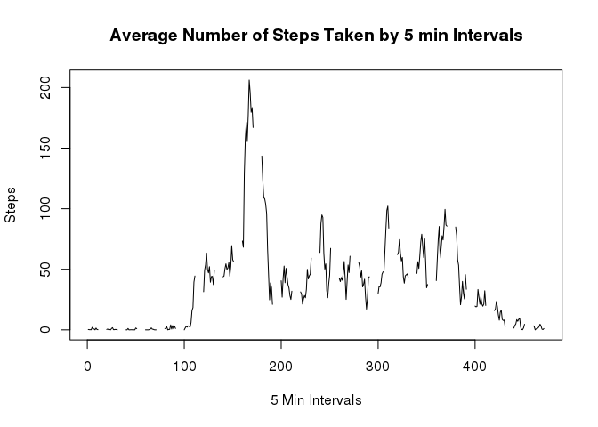
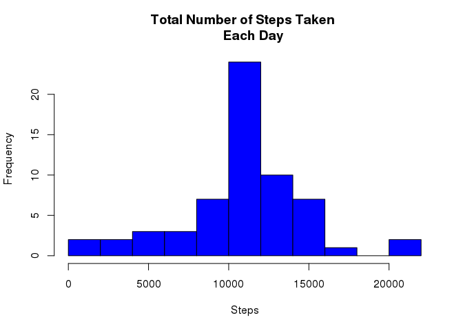
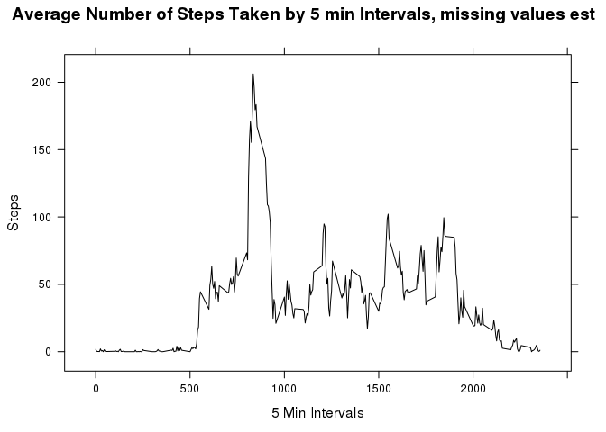
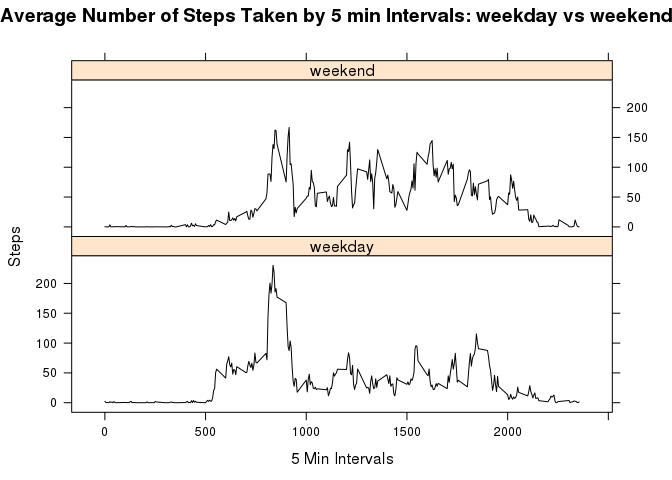

# Reproducible Research: Peer Assessment 1

1.Setting up the Data


```r
library(lattice)
library(dplyr)
```

```
## 
## Attaching package: 'dplyr'
```

```
## The following objects are masked from 'package:stats':
## 
##     filter, lag
```

```
## The following objects are masked from 'package:base':
## 
##     intersect, setdiff, setequal, union
```

```r
library(reshape2)
url <-
    "https://d396qusza40orc.cloudfront.net/repdata%2Fdata%2Factivity.zip"
download.file(url, "datactivity.zip")
#Download File Feb 19 2016 at 12:05 pm
datactivity <- unzip("./datactivity.zip")
activity <- read.csv(datactivity, sep = ",", header = TRUE)
#make the Date in date format
activity$date <- as.Date(activity$date, "%Y-%m-%d")
```

2. Histogram of the total number of steps taken each day
Summing the total number of steps by day


```r
totalstepseachday<-
        activity %>%
        group_by(date)%>%
        summarise(stepsum=sum(steps))
```

There are 61 days in the dataset


```r
hist(totalstepseachday$stepsum, breaks= 10, main = "Total Number of Steps Taken 
     Each Day", xlab = "Steps", col = "blue")
```


3a. What is the mean total number of steps taken each day?


```r
stepmean<-mean(totalstepseachday$stepsum, na.rm = TRUE)
stepmean
```

```
## [1] 10766.19
```

3b. What is the median number of steps taken each day?

```r
stepmedian <- median(totalstepseachday$stepsum, na.rm = TRUE)
stepmedian
```

```
## [1] 10765
```

4.Make a time series plot (ie type="1") of the 5 minute interval and the avg
number of steps taken, averaged across all days (y-axis)

a. Cutting every 5 seconds starting at 0

```r
cuts<-cut(activity$interval, breaks = seq(0, max(activity$interval), 5))
meanintervals<-by(activity$steps, cuts, mean, na.rm=TRUE)
plot(meanintervals, main= "Average Number of Steps Taken by 5 min Intervals", xlab="5 Min Intervals", ylab ="Steps", type="l")
```



5. Which 5 minute interval on average across all the days in the data set
contains the max number of steps

```r
max(meanintervals, na.rm = TRUE)
```

```
## [1] 206.1698
```

6. Calculate and report the total number of missing values in the dataset (i.e. the total number of rows with NAs)


```r
sum(is.na(activity$steps))
```

```
## [1] 2304
```

7.Devise a strategy for filling in all of the missing values in the dataset. 
The strategy does not need to be sophisticated. For example, you could use the mean/median for that day, or the mean for that 5-minute interval, etc.

WIll first create a new data frame that contains the mean for that 5 minute interval


```r
library(reshape2)
NoNA<-melt(data=activity, id.vars= "interval"  , measure.vars= "steps", na.rm =T)
NoNa_2<-dcast(NoNA, interval ~ variable, mean)
activity2<-activity
for ( i in 1:nrow(activity2)){
        if (is.na(activity2$steps[i])==TRUE) {
                replace<-NoNa_2$steps[NoNa_2$interval==activity2$interval[i]];
                activity2$steps[i]<-replace;
        }
}
```

Will make sure that missing values are replaced


```r
sum(is.na(activity2$steps))
```

```
## [1] 0
```

Make a histogram of the total number of steps taken each day and Calculate and report the mean and median total number of steps taken per day.


```r
NoMissing_sumsteps<-aggregate(steps~date, activity2, sum)
hist(NoMissing_sumsteps$steps, breaks=10, main = "Total Number of Steps Taken 
     Each Day", xlab = "Steps", col = "blue")
```



Calculate the mean number of steps

```r
#Calculate Mean 
mean(NoMissing_sumsteps$steps)
```

```
## [1] 10766.19
```

Calculate Median

```r
median(NoMissing_sumsteps$steps)
```

```
## [1] 10766.19
```
Do these values differ from the estimates from earlier part of the assignment?

The mean and median calculated with the data set that had the missing values replaced are very similar to the mean and median from the non missing data set.The median with the replaced data set is slightly higher by 1 step. In addition, the histograms appear very similar.

8. Make a time series plot for the 5-minute interval (x-axis) and the average number of steps taken, averaged across all days (y-axis)

```r
meanIntervals2<-aggregate(steps~interval, data=activity2, FUN = "mean", na.exclude=TRUE)
xyplot(meanIntervals2$steps ~meanIntervals2$interval, main= "Average Number of Steps Taken by 5 min Intervals, missing values est", 
       xlab="5 Min Intervals", ylab ="Steps", type="l", col= "black")
```


9. Are there differences in activity patterns between weekdays and weekends?

```r
activity2$day<-"weekday"
activity2$day[weekdays(as.Date(activity2$date), abb=T) %in% c("Sat", "Sun")]<-"weekend"
table(activity2$day)
```

```
## 
## weekday weekend 
##   12960    4608
```
Make a panel plot containing a time series plot (i.e. type = “l”) of the 5-minute interval (x-axis) and the average number of steps taken, averaged across all weekday days or weekend days (y-axis).

```r
meanIntervals3<-aggregate(steps~interval +day, data=activity2, FUN = mean, na.exclude=TRUE)
xyplot(steps~interval | day, data=meanIntervals3, main= "Average Number of Steps Taken by 5 min Intervals: weekday vs weekend", layout=c(1,2),
       xlab="5 Min Intervals", ylab ="Steps", type="l", col= "black")
```



