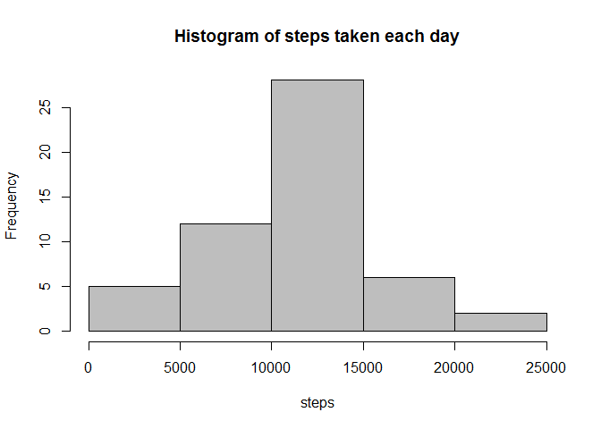
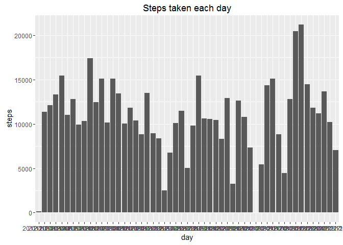
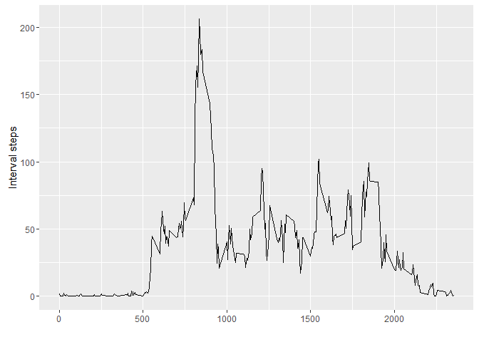
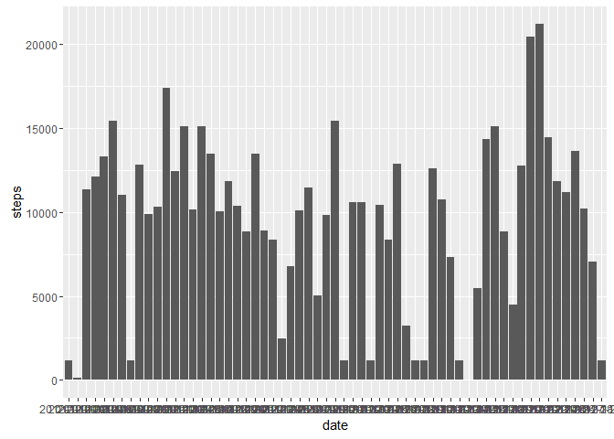
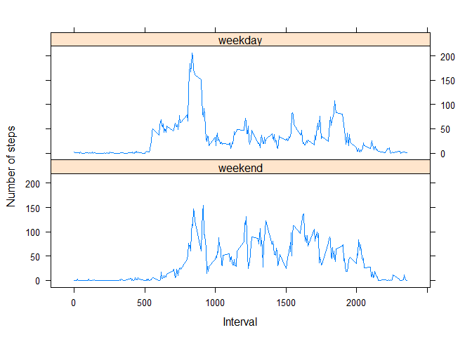

# Assignment_week1
Eszter Takacs  
27. April 2016  

This is an R Markdown document. Markdown is a simple formatting syntax for authoring HTML, PDF, and MS Word documents. For more details on using R Markdown see <http://rmarkdown.rstudio.com>.


* Loading and preprocessing the data


```r
setwd("~/Eszter C/Spotfire Edu/Data science")
unzip("repdata-data-activity.zip")
mydata <- read.csv("activity.csv")
```
## What is mean total number of steps taken per day?
* Make a histogram of the total number of steps taken each day

```r
totalsteps <- aggregate(steps ~ date, data=mydata, FUN=sum)
hist(totalsteps$steps, xlab="steps", main="Histogram of steps taken each day", col="grey")

library(ggplot2)
```

```
## Warning: package 'ggplot2' was built under R version 3.2.4
```



```r
qplot(date, data=totalsteps, geom="bar", weight=steps, ylab="steps", xlab="day", main="Steps taken each day")
```



* Calculate and report the mean and median total number of steps taken per day

```r
mean(totalsteps$steps)
```

```
## [1] 10766.19
```

```r
median(totalsteps$steps)
```

```
## [1] 10765
```
## What is the average daily activity pattern?

* Make a time series plot (i.e. type = "l") of the 5-minute interval (x-axis) and the average number of steps taken, averaged across all days (y-axis)

```r
intervalsteps <- aggregate(steps ~ interval, data=mydata, FUN=mean)
library(ggplot2)
ggplot(intervalsteps, aes(interval, steps)) + geom_line() + xlab("") + ylab("Interval steps")
```


* Which 5-minute interval, on average across all the days in the dataset, contains the maximum number of steps?

```r
intervalsteps$interval[which.max(intervalsteps$steps)]
```

```
## [1] 835
```
## Imputing missing values
* Calculate and report the total number of missing values in the dataset (i.e. the total number of rows with NAs)

```r
sum(!complete.cases(mydata))
```

```
## [1] 2304
```
* Devise a strategy for filling in all of the missing values in the dataset. The strategy does not need to be sophisticated. For example, you could use the mean/median for that day, or the mean for that 5-minute interval, etc.
Create a new dataset that is equal to the original dataset but with the missing data filled in.

```r
mydata2<-mydata
mydata2$steps[which(is.na(mydata2$steps))]<-  with(mydata2, ave(steps, interval, FUN = function(x) median(x, na.rm = TRUE)))[is.na(mydata2$steps)]
```
* Make a histogram of the total number of steps taken each day and Calculate and report the mean and median total number of steps taken per day. Do these values differ from the estimates from the first part of the assignment? What is the impact of imputing missing data on the estimates of the total daily number of steps?

```r
totalsteps2 <- aggregate(steps ~ date, data=mydata2, FUN=sum)
qplot(date, data=totalsteps2, geom="bar", weight=steps, ylab="steps")
```



```r
mean(totalsteps2$steps)
```

```
## [1] 9503.869
```

```r
mean(totalsteps$steps)
```

```
## [1] 10766.19
```

```r
median(totalsteps2$steps)
```

```
## [1] 10395
```

```r
median(totalsteps$steps)
```

```
## [1] 10765
```

```r
##impact of replacing NA-s: decreasing values, used logic: interval mean
```
## Are there differences in activity patterns between weekdays and weekends?
* Create a new factor variable in the dataset with two levels -- "weekday" and "weekend" indicating whether a given date is a weekday or weekend day.

```r
mydata2$date <- as.Date(mydata2$date)
#create a vector of weekdays
weekday <- c('Montag', 'Dienstag', 'Mittwoch', 'Donnerstag', 'Freitag')
#Use `%in%` and `weekdays` to create a logical vector
#convert to `factor` and specify the `levels/labels`
mydata2$Day <- factor((weekdays(mydata2$date) %in% weekday), 
levels=c(FALSE, TRUE), labels=c('weekend', 'weekday')) 
```
* Make a panel plot containing a time series plot (i.e. type = "l") of the 5-minute interval (x-axis) and the average number of steps taken, averaged across all weekday days or weekend days (y-axis). 

```r
head(mydata2)
```

```
##   steps       date interval     Day
## 1     0 2012-10-01        0 weekday
## 2     0 2012-10-01        5 weekday
## 3     0 2012-10-01       10 weekday
## 4     0 2012-10-01       15 weekday
## 5     0 2012-10-01       20 weekday
## 6     0 2012-10-01       25 weekday
```

```r
library("lattice")

stepsDay <- aggregate(steps ~ interval+Day, data = mydata2, mean)

xyplot(steps ~ interval | Day, stepsDay, type = "l", layout = c(1, 2), 
       xlab = "Interval", ylab = "Number of steps")
```



    keep_md: yes
---
