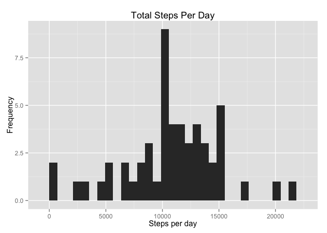
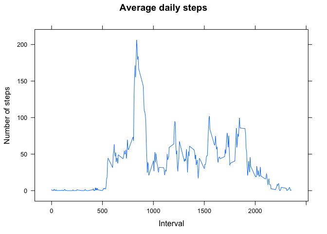
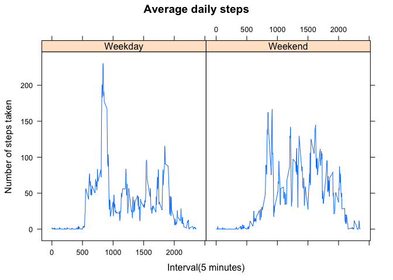

# Reproducible Research: Peer Assessment 1

## Loading and preprocessing the data


### dowloading the data :

First of all, this code will check if the zip file exists, if not it will download and unzip it.


```r
if(!file.exists("activity.zip")){
  fileUrl <- "https://d396qusza40orc.cloudfront.net/repdata%2Fdata%2Factivity.zip"
  download.file(fileUrl,destfile = "activity.zip",method = "curl")
}
  unzip("activity.zip")
```
### loading the extracted file with read.csv() 


```r
data <- read.csv("activity.csv", sep=",", header=TRUE)
```

### Transforming the data into a format suitable for your analysis

Changing the class of the "Date" column and only working with none NA values seem like 2 good ideas


```r
date <- as.Date(data$date,"%y-%m-%d")
activity <- data[which(data$steps!="NA"),]
```


## What is mean total number of steps taken per day?

1. Calculate the total number of steps taken per day. 


```r
daySteps <- aggregate(steps ~ date, data = activity, FUN = "sum")
```

2. Make a histogram of the total number of steps taken each day


```r
library(ggplot2)
qplot(steps, data=daySteps, geom = "histogram", main = "Total Steps Per Day", xlab = "Steps per day",ylab = "Frequency")
```

```
## stat_bin: binwidth defaulted to range/30. Use 'binwidth = x' to adjust this.
```

 

3. Calculate and report the mean and median of the total number of steps taken per day


```r
mean(daySteps$steps)
```

```
## [1] 10766.19
```

```r
median(daySteps$steps)
```

```
## [1] 10765
```

## What is the average daily activity pattern?


1. Make a time series plot (i.e. type = "l") of the 5-minute interval (x-axis) and the average number of steps taken, averaged across all days (y-axis)


```r
stepsInterval <- aggregate(steps ~ interval, data=activity,FUN = mean)
library(lattice)
xyplot(steps ~ interval, stepsInterval, type = "l",
       xlab = "Interval", ylab = "Number of steps",
       main="Average daily steps")
```

 

2. Which 5-minute interval, on average across all the days in the dataset, contains the maximum number of steps?

```r
stepsInterval$interval[which.max(stepsInterval$steps)]
```

```
## [1] 835
```

## Imputing missing values

1. Calculate and report the total number of missing values in the dataset (i.e. the total number of rows with NAs)


```r
sum(is.na(data))
```

```
## [1] 2304
```

2. Devise a strategy for filling in all of the missing values in the dataset. The strategy does not need to be sophisticated. For example, you could use the mean/median for that day, or the mean for that 5-minute interval, etc.

3. Create a new dataset that is equal to the original dataset but with the missing data filled in.

 The steps taken are :
 
 * Merging the original dataset with "stepsInterval" which contains the mean values
* Replace the NA values by the means
  * deleting the mean values from data2 in order to be just like the original dataset without NA values 
  * Replacing the original dataset with the new one
  
  

```r
data2 <- merge(data, stepsInterval, by="interval", suffixes=c("",".new"))
NAs <- is.na(data2$steps)
data2$steps[NAs]<-data2$steps.new[NAs]
data2 <- data2[,c(1:3)]
data <- data2
```

4. Make a histogram of the total number of steps taken each day and Calculate and report the mean and median total number of steps taken per day. Do these values differ from the estimates from the first part of the assignment? What is the impact of imputing missing data on the estimates of the total daily number of steps?

```r
daySteps2 <- aggregate(steps ~ date, data = data, FUN = "sum")
library(ggplot2)
qplot(steps, data=daySteps, geom = "histogram", main = "Total Steps Per Day", xlab = "Steps per day",ylab = "Frequency")
```

```
## stat_bin: binwidth defaulted to range/30. Use 'binwidth = x' to adjust this.
```

 

```r
mean(daySteps2$steps)
```

```
## [1] 10766.19
```

```r
median(daySteps2$steps)
```

```
## [1] 10766.19
```
We notice  that the impact of missing data for steps is low when comparing it with the mean and the median of daily steps.

## Are there differences in activity patterns between weekdays and weekends?

1. Create a new factor variable in the dataset with two levels -- "weekday" and "weekend" indicating whether a given date is a weekday or weekend day.


```r
Day <- weekdays(as.Date(data$date))
DayLevel <- vector()
for(i in 1:nrow(data)){
    if (Day[i]== "Saturday"){
        DayLevel[i] <- "Weekend"
    }
    else if (Day[i]== "Sunday"){
        DayLevel[i] <- "Weekend"
    }
    else { DayLevel[i] <- "Weekday" }
}
data$DayLevel <- DayLevel
DayLevel <- factor(DayLevel)
```
2. Make a panel plot containing a time series plot (i.e. type = "l") of the 5-minute interval (x-axis) and the average number of steps taken, averaged across all weekday days or weekend days (y-axis).

```r
DaysData <- aggregate(steps ~ interval + DayLevel, data = data, FUN="mean")
library(lattice)
xyplot(steps ~ interval | DayLevel, DaysData, type = "l",
       xlab = "Interval(5 minutes)", ylab = "Number of steps taken",
       main="Average daily steps")
```

 
