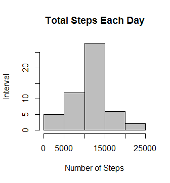
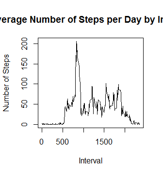
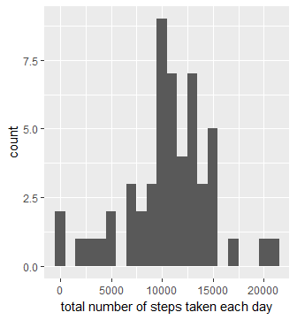
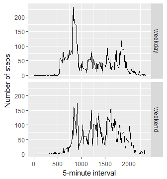

# Reproducible Research: Peer Assessment 1

##  Load the activity Data
```{r}
Activity_data <- read.csv("activity.csv")
str(Activity_data)
```

## 2 Histogram of the total number of steps taken each day
```{r}
steps_by_day <- aggregate(steps ~ date, Activity_data, sum)
hist(steps_by_day$steps, main = paste("Total Steps Each Day"), col="Gray", xlab="Number of Steps",ylab="Interval")
```

 

## 3 Mean and median number of steps taken each day
### Mean
```r
rmean <- mean(steps_by_day$steps)

```

```
## [1] 1076.19
```
### Median
```r
rmedian <- median(steps_by_day$steps)
```

```
## [1] 10765
```

## 4 Time series plot of the average number of steps taken
```{r}
steps_by_interval <- aggregate(steps ~ interval, Activity_data, mean)
plot(steps_by_interval$interval,steps_by_interval$steps, type="l", xlab="Interval", ylab="Number ofSteps",main="Average Number of Steps per Day by Interval")
```
 


## 5 The 5-minute interval that, on average, contains the maximum number of steps
```{r}
max_interval <- steps_by_interval[which.max(steps_by_interval$steps),1]
```
```
## [1] 835
```

## 6 Code to describe and show a strategy for imputing missing data
```{r}
incomplete <- sum(!complete.cases(Activity_data))
incomplete

fill.value <- function(steps, interval) {
  filled <- NA
  if (!is.na(steps))
    filled <- c(steps)
  else
    filled <- (steps_by_interval[steps_by_interval$interval==interval, "steps"])
  return(filled)
}
filled.data <- Activity_data
filled.data$steps <- mapply(fill.value, filled.data$steps, filled.data$interval)
```

```
## [1] 2304
```
## 7 Histogram of the total number of steps taken each day after missing values are imputed
```{r}
total.steps <- tapply(filled.data$steps, filled.data$date, FUN=sum)
qplot(total.steps, binwidth=1000, xlab="total number of steps taken each day")
mean(total.steps)
median(total.steps)
```
 

## 8-Panel plot comparing the average number of steps taken per 5-minute interval across weekdays and weekends
```{r}
weekday.or.weekend <- function(date) {
  day <- weekdays(date)
  if (day %in% c("Monday", "Tuesday", "Wednesday", "Thursday", "Friday"))
    return("weekday")
  else if (day %in% c("Saturday", "Sunday"))
    return("weekend")
  else
    stop("invalid date")
}
filled.data$date <- as.Date(filled.data$date)
filled.data$day <- sapply(filled.data$date, FUN=weekday.or.weekend)


averages <- aggregate(steps ~ interval + day, data=filled.data, mean)
ggplot(averages, aes(interval, steps)) + geom_line() + facet_grid(day ~ .) +
  xlab("5-minute interval") + ylab("Number of steps")
```
 


