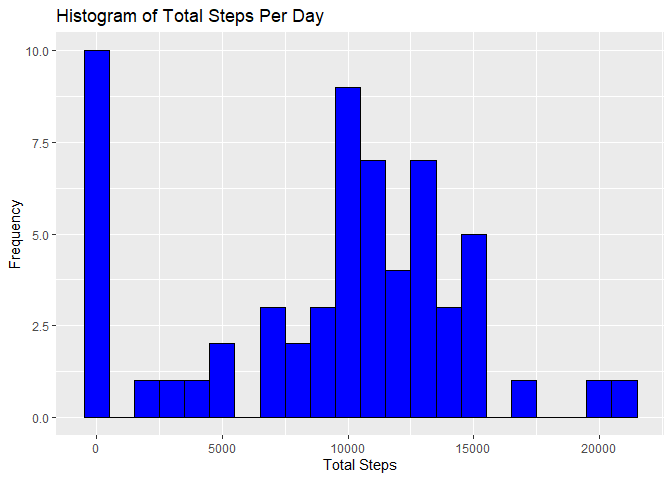
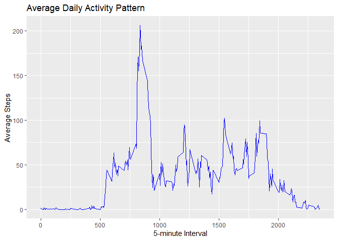
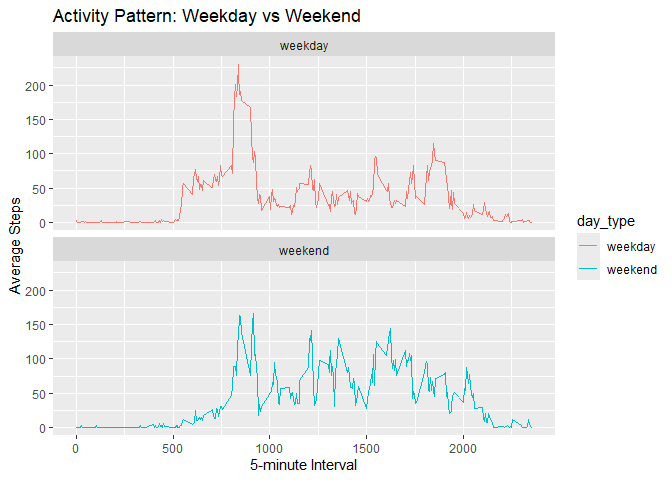

## Loading and preprocessing the data


``` r
# Load the necessary libraries
library(dplyr)
library(ggplot2)

# Load the data
Data <- read.csv("activity.csv")

# Convert date column to Date class
Data$date <- as.Date(Data$date, format="%Y-%m-%d")

# Display summary of the data
summary(Data)
```

```
##      steps             date               interval     
##  Min.   :  0.00   Min.   :2012-10-01   Min.   :   0.0  
##  1st Qu.:  0.00   1st Qu.:2012-10-16   1st Qu.: 588.8  
##  Median :  0.00   Median :2012-10-31   Median :1177.5  
##  Mean   : 37.38   Mean   :2012-10-31   Mean   :1177.5  
##  3rd Qu.: 12.00   3rd Qu.:2012-11-15   3rd Qu.:1766.2  
##  Max.   :806.00   Max.   :2012-11-30   Max.   :2355.0  
##  NA's   :2304
```

``` r
## What is mean total number of steps taken per day?
# Calculate total steps per day
Steps.pr.Day <- Data %>%
  group_by(date) %>%
  summarise(total_steps = sum(steps, na.rm=TRUE))

# Display the first few rows
head(Steps.pr.Day)
```

```
## # A tibble: 6 × 2
##   date       total_steps
##   <date>           <int>
## 1 2012-10-01           0
## 2 2012-10-02         126
## 3 2012-10-03       11352
## 4 2012-10-04       12116
## 5 2012-10-05       13294
## 6 2012-10-06       15420
```

``` r
# Plot histogram of total steps per day
ggplot(Steps.pr.Day, aes(x=total_steps)) +
  geom_histogram(binwidth=1000, fill="blue", color="black") +
  labs(title="Histogram of Total Steps Per Day", x="Total Steps", y="Frequency")
```

<!-- -->

``` r
# Calculate the mean and median of total steps per day
mean_steps <- mean(Steps.pr.Day$total_steps, na.rm=TRUE)
median_steps <- median(Steps.pr.Day$total_steps, na.rm=TRUE)
mean_steps
```

```
## [1] 9354.23
```

``` r
median_steps
```

```
## [1] 10395
```

``` r
## What is the average daily activity pattern?
# Calculate average steps per 5-minute interval
Avg.Steps.per.Interval <- Data %>%
  group_by(interval) %>%
  summarise(average_steps = mean(steps, na.rm=TRUE))

# Plot the time series
ggplot(Avg.Steps.per.Interval, aes(x=interval, y=average_steps)) +
  geom_line(color="blue") +
  labs(title="Average Daily Activity Pattern", x="5-minute Interval", y="Average Steps")
```

<!-- -->

``` r
## Imputing missing values
# Count the total number of missing values
total_missing <- sum(is.na(Data$steps))
total_missing
```

```
## [1] 2304
```

``` r
# Impute missing values with the average steps per interval
Complete.Data <- Data
for (i in 1:nrow(Complete.Data)) {
  if (is.na(Complete.Data$steps[i])) {
    interval_value <- Complete.Data$interval[i]
    Complete.Data$steps[i] <- Avg.Steps.per.Interval$average_steps[
      Avg.Steps.per.Interval$interval == interval_value]
  }
}

# Check the structure after imputation
str(Complete.Data)
```

```
## 'data.frame':	17568 obs. of  3 variables:
##  $ steps   : num  1.717 0.3396 0.1321 0.1509 0.0755 ...
##  $ date    : Date, format: "2012-10-01" "2012-10-01" ...
##  $ interval: int  0 5 10 15 20 25 30 35 40 45 ...
```

``` r
## Are there differences in activity patterns between weekdays and weekends?
# Create a factor variable to differentiate weekdays and weekends
Complete.Data$day_type <- ifelse(weekdays(Complete.Data$date) %in% c("Saturday", "Sunday"), "weekend", "weekday")
Complete.Data$day_type <- as.factor(Complete.Data$day_type)

# Calculate average steps per interval by day type
Avg.Steps.DayType <- Complete.Data %>%
  group_by(interval, day_type) %>%
  summarise(average_steps = mean(steps, na.rm=TRUE))
```

```
## `summarise()` has grouped output by 'interval'. You can override using the
## `.groups` argument.
```

``` r
# Plot the activity pattern for weekdays and weekends
ggplot(Avg.Steps.DayType, aes(x=interval, y=average_steps, color=day_type)) +
  geom_line() +
  facet_wrap(~day_type, ncol=1) +
  labs(title="Activity Pattern: Weekday vs Weekend", x="5-minute Interval", y="Average Steps")
```

<!-- -->
