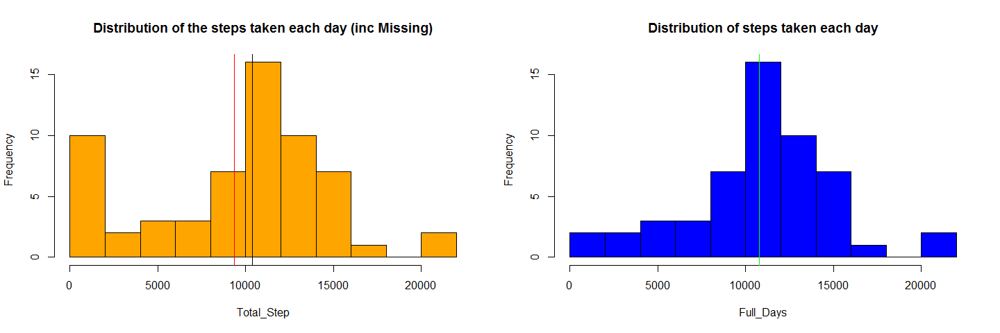
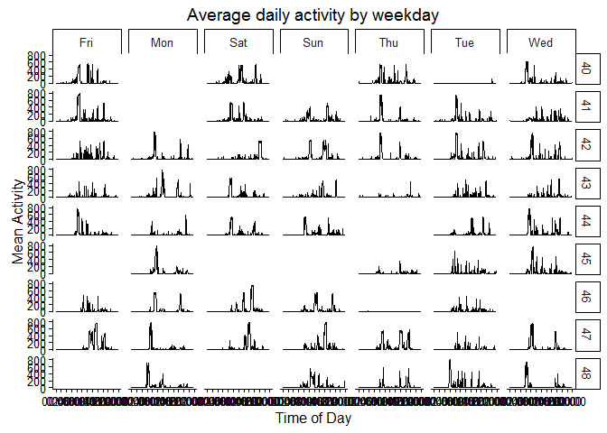
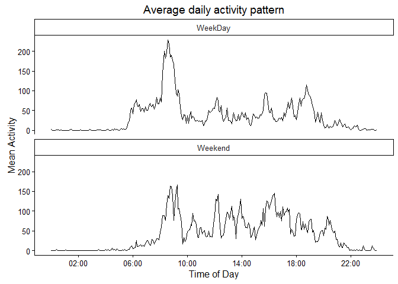

# Project Part 1
Donnchadh  
19 January 2016  

## Loading and preprocessing the data

* Load the data  

* Process/transform the data (if necessary) into a format suitable for your analysis  


```r
#Loading and preprocessing the data
download.file("https://d396qusza40orc.cloudfront.net/repdata%2Fdata%2Factivity.zip",destfile = "Factivity", mode="wb")
Activitydata <- read.csv(unzip("Factivity"))
## Convert Time of Day to POSIXct
library(lubridate)
Activitydata$date <- ymd(Activitydata$date)

## add Time of Day by using interval, HHMM time formate
library(dplyr)
library(stringr)
Activitydata <- Activitydata %>% mutate(TimeofDay = str_pad(interval, 4, pad = "0"))
Activitydata$TimeofDay <- as.POSIXct(strptime(gsub("([[:digit:]]{2,2})$", ":\\1", Activitydata$TimeofDay),format = "%R"))
```

## What is mean total number of steps taken per day?

* Calculate the total number of steps taken per day

* Make a histogram of the total number of steps taken each day

* Calculate and report the mean and median of the total number of steps taken per day


```r
## Calculate the total number of steps taken per day
Total_Step <- tapply(Activitydata$steps, Activitydata$date, function(x){
  sum(x, na.rm = T)
})

barplot(Total_Step, main = "Total Steps per Day")
```

 

```r
## Some days have no activity which will effect the mean and median. These should probably be removed??
Full_Days <- Total_Step[Total_Step > 0]
  
## Calculate and report the mean and median of the total number of steps taken per day
MeanRes_T <- round(mean(Total_Step), 0)
MedRes_T <- round(median(Total_Step), 0)

MeanRes <- round(mean(Full_Days), 0)
MedRes <- round(median(Full_Days), 0)

par(mfrow=c(1,2))
hist(Total_Step, breaks = 15,main = "Distribution of the steps taken each day (inc Missing)",col="orange")
abline(v=MeanRes_T, col="Red")
abline(v=MedRes_T, col="black")

hist(Full_Days, breaks = 15,main = "Distribution of steps taken each day",col="blue")
abline(v=MeanRes, col="Red")
abline(v=MedRes, col="green")
```

 

The Average number of total steps per days is 9354

"The Medium number of total steps per days is 1.0395\times 10^{4}


## What is the average daily activity pattern?

* Make a time series plot of the 5-minute interval and the average number of steps taken, averaged across all days  

* Identfy the 5-minute interval, on average across all the days in the dataset, contains the maximum number of steps?


```r
## Calculate the mean steps per interval

MeanStepday <- Activitydata %>%
  group_by(TimeofDay,interval) %>% 
  summarise(MeanDay = mean(steps,na.rm=TRUE))

## Plot the mean steps 
library(scales)
library(ggplot2)
```

```
## Warning: package 'ggplot2' was built under R version 3.2.3
```

```r
ggplot(MeanStepday,aes(y=MeanDay,x=TimeofDay)) + 
  geom_line() + 
  scale_x_datetime(breaks = date_breaks("2 hour"), labels = date_format("%H:%M")) + 
  labs(x="Time of Day", y = "Mean Activity") + 
  theme_classic() +
  ggtitle("Average daily activity pattern")
```

 

```r
# Which 5-minute interval, on average across all the days in the dataset, contains the maximum number of steps?

HighInterval <- MeanStepday[which(MeanStepday$MeanDay==max(MeanStepday$MeanDay)),]

with(HighInterval,(paste0(format(TimeofDay,"%R")," (",interval,") ","has the highest average number of steps in the data set of ",round(MeanDay,2))))
```

```
## [1] "08:35 (835) has the highest average number of steps in the data set of 206.17"
```

## Imputing missing values

* Calculate and report the total number of missing values in the dataset  

* Impute all of the missing values in the dataset  

* Create a new dataset that is equal to the original dataset but with the missing data filled in  

* Make a histogram of the total number of steps taken each day and Calculate and report the mean and median total number of steps taken per day. Do these values differ from the estimates from the first part of the assignment? What is the impact of imputing missing data on the estimates of the total daily number of steps?


```r
## Total Missing values
AllMissing <- sum(is.na(Activitydata$steps))

print(paste("The total no of missing values in the data set is", AllMissing))
```

```
## [1] "The total no of missing values in the data set is 2304"
```

```r
## Identfy strategy for imputing missing data 

MeanStepday <- Activitydata %>%
  group_by(TimeofDay,Day = strftime(date,format = "%a"), Week= strftime(Activitydata$date,format = "%U") ) %>% 
  summarise(MeanDay = mean(steps,na.rm=TRUE))

## Plot the mean steps 
library(scales)
library(ggplot2)
ggplot(MeanStepday,aes(y=MeanDay,x=TimeofDay)) + 
  geom_line() + 
  scale_x_datetime(breaks = date_breaks("2 hour"), labels = date_format("%H:%M")) + 
  labs(x="Time of Day", y = "Mean Activity", title="Average daily activity by weekday") + 
  theme_classic() + facet_grid(Week~Day)
```

 


## Evidence of interval and time effect (eg day, week etc on number of steps).


```r
## Make a copy of the data set and imput the missing values.
Activitydata_New <- Activitydata
Activitydata_New$interval <- as.factor(Activitydata_New$interval)
Activitydata_New$Week <- as.factor(strftime(Activitydata_New$date,format = "%U"))
Activitydata_New$Day <- as.factor(strftime(Activitydata_New$date,format = "%a"))

## use a simple general linear model to imput missing count values, using day interval and week id.
Mod.Miss <- glm(steps ~  interval + Day + Week,family= "poisson", na.action= "na.omit",data = Activitydata_New )

## Impute Missing value (Whole Numbers) using model
Activitydata_New$steps[is.na(Activitydata_New$steps)] <- round(predict(Mod.Miss, newdata = Activitydata_New[is.na(Activitydata_New$steps),], type = "response"),0)

## Make a Histograme of total number of steps taken each day on new data set
Total_Step_new <- tapply(Activitydata_New$steps, Activitydata_New$date, function(x){
  sum(x, na.rm = T)
})

MeanRes_new <- round(mean(Total_Step_new), 0)
MedRes_new <- round(median(Total_Step_new), 0)

par(mfrow=c(1,1))
hist(Total_Step_new, breaks = 15,main = "Distribution of the steps taken each day (No Missing)",col="Green")
abline(v=MeanRes_new, col="Red")
abline(v=MedRes_new, col="black")
```

 

```r
print(paste("Initial mean", MeanRes_T, "New mean", MeanRes_new))
```

```
## [1] "Initial mean 9354 New mean 10735"
```

```r
print(paste("Initial medium", MedRes_T, "New medium", MedRes_new))
```

```
## [1] "Initial medium 10395 New medium 10875"
```


## Are there differences in activity patterns between weekdays and weekends?

* Create a new factor variable in the dataset with two levels – “weekday” and “weekend”.

* Make a panel plot containing a time series plot (i.e. type = "l") of the 5-minute interval (x-axis) and the average number of steps taken, averaged across all weekday days or weekend days (y-axis).


```r
# add weekdays 
Activitydata_New$Weekday <- as.numeric(format(Activitydata_New$date,"%w"))

# Week Days is coded as 1:5 satherday and Sundays coded as 6 & 0
# Code for weekdays and weekends

Activitydata_New$Week_End <- as.factor(ifelse(Activitydata_New$Weekday >=1 & Activitydata_New$Weekday <= 5, "WeekDay","Weekend" ))

## Compare Week day to Weekend
Week_Weekend <- Activitydata_New %>% group_by(TimeofDay,Week_End) %>% summarise(Meanwd = mean(steps,na.rm=TRUE))

## Plot the mean steps 
ggplot(Week_Weekend,aes(y=Meanwd,x=TimeofDay)) + 
  geom_line() + facet_wrap(~Week_End,ncol = 1)+
  scale_x_datetime(breaks = date_breaks("4 hour"), labels = date_format("%H:%M")) + 
  labs(x="Time of Day", y = "Mean Activity") + 
  theme_classic() +
  ggtitle("Average daily activity pattern")
```

 

