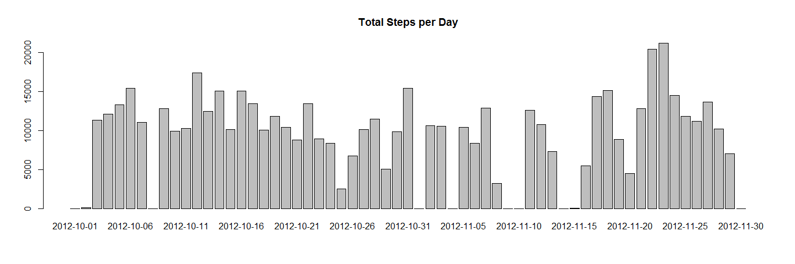
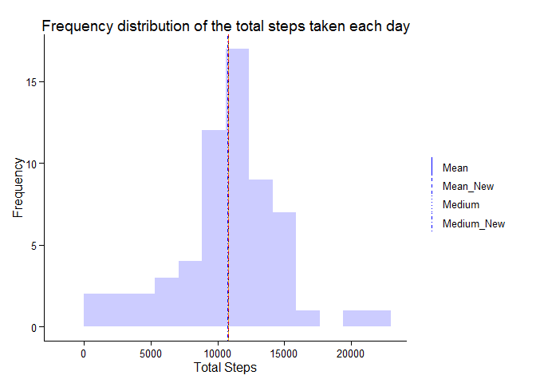
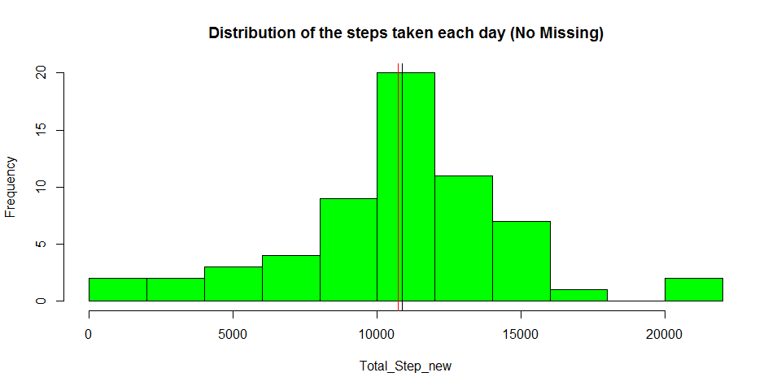

# PA2
Donnchadh  
20 December 2015  

## Loading and preprocessing the data

* Load the data  

* Process/transform the data (if necessary) into a format suitable for your analysis  


```r
library(stringr)
library(dplyr)
library(ggplot2)
library(scales)

temp <- tempfile()

download.file("https://d396qusza40orc.cloudfront.net/repdata%2Fdata%2Factivity.zip",temp, mode="wb")
Activitydata <- read.csv(unzip(temp))  

summary(Activitydata)
```

```
##      steps                date          interval     
##  Min.   :  0.00   2012-10-01:  288   Min.   :   0.0  
##  1st Qu.:  0.00   2012-10-02:  288   1st Qu.: 588.8  
##  Median :  0.00   2012-10-03:  288   Median :1177.5  
##  Mean   : 37.38   2012-10-04:  288   Mean   :1177.5  
##  3rd Qu.: 12.00   2012-10-05:  288   3rd Qu.:1766.2  
##  Max.   :806.00   2012-10-06:  288   Max.   :2355.0  
##  NA's   :2304     (Other)   :15840
```

```r
str(Activitydata)
```

```
## 'data.frame':	17568 obs. of  3 variables:
##  $ steps   : int  NA NA NA NA NA NA NA NA NA NA ...
##  $ date    : Factor w/ 61 levels "2012-10-01","2012-10-02",..: 1 1 1 1 1 1 1 1 1 1 ...
##  $ interval: int  0 5 10 15 20 25 30 35 40 45 ...
```

```r
Activitydata$date <- as.Date(Activitydata$date,formate = "%Y-%m-%d")

## add Time of Day in 24 hour formate

Activitydata <- Activitydata %>% mutate(TimeofDay = str_pad(interval, 4, pad = "0"))

Activitydata$TimeofDay <- as.POSIXct(strptime(gsub("([[:digit:]]{2,2})$", ":\\1", Activitydata$TimeofDay),format = "%R"))
```

## What is mean total number of steps taken per day?

* Calculate the total number of steps taken per day

* Make a histogram of the total number of steps taken each day

* Calculate and report the mean and median of the total number of steps taken per day


```r
## Identfy if any full days having all missing values (These may affect the mean by providing 0 values for theses days)

plot(Activitydata$date, !is.na(Activitydata$steps),type="l", xlab="date",ylab="Complete Data", main="Days with no activity")
```

 

```r
## remove these days
Full_Days <- as.data.frame(table(Activitydata$date, is.na(Activitydata$steps)))
DropData <- Activitydata$date %in% as.Date(Full_Days$Var1[Full_Days$Freq==288 & Full_Days$Var2=="TRUE"])

## Calculate the total number of steps taken per day

TotStepday <- Activitydata[!DropData,] %>% group_by(date) %>% summarise(Total = sum(steps, na.rm = TRUE))

## Calculate and report the mean and median of the total number of steps taken per day

MeanRes <- as.integer(round( mean(TotStepday$Total), 0))
MedRes <- as.integer(round( median(TotStepday$Total), 0))

ggplot(TotStepday,aes(Total)) + 
  geom_histogram(fill="Blue",alpha = .2,binwidth = max(TotStepday$Total)/12) + 
  theme_classic() +
  ggtitle("Frequency distribution of the total steps taken each day") +
  labs(x="Total Steps", y="Frequency") +
  geom_vline(aes(lty="Mean",xintercept=MeanRes),col="red",show_guide = TRUE) +
  geom_vline(aes(lty="Medium",xintercept=MedRes),col="black",show_guide = TRUE) +
  scale_linetype_manual(name="",values=c(1:2))
```

 

The Average number of total steps per days is 10766

"The Medium number of total steps per days is 10765


## What is the average daily activity pattern?

* Make a time series plot of the 5-minute interval and the average number of steps taken, averaged across all days  

* Identfy the 5-minute interval, on average across all the days in the dataset, contains the maximum number of steps?


```r
## Calculate the mean steps per interval

MeanStepday <- Activitydata %>%
  group_by(TimeofDay,interval) %>% 
  summarise(MeanDay = mean(steps,na.rm=TRUE))

## Plot the mean steps 
ggplot(MeanStepday,aes(y=MeanDay,x=TimeofDay)) + 
  geom_line() + 
  scale_x_datetime(breaks = date_breaks("2 hour"), labels = date_format("%H:%M")) + 
  labs(x="Time of Day", y = "Mean Activity") + 
  theme_classic() +
  ggtitle("Average daily activity pattern")
```

 

```r
# Which 5-minute interval, on average across all the days in the dataset, contains the maximum number of steps?

HighInterval <- MeanStepday[which(MeanStepday$MeanDay==max(MeanStepday$MeanDay)),]

with(HighInterval,(paste0(format(TimeofDay,"%R")," (",interval,") ","has the highest average number of steps in the data set of ",round(MeanDay,2))))
```

```
## [1] "08:35 (835) has the highest average number of steps in the data set of 206.17"
```

## Imputing missing values

* Calculate and report the total number of missing values in the dataset  

* Impute all of the missing values in the dataset  

* Create a new dataset that is equal to the original dataset but with the missing data filled in  

* Make a histogram of the total number of steps taken each day and Calculate and report the mean and median total number of steps taken per day. Do these values differ from the estimates from the first part of the assignment? What is the impact of imputing missing data on the estimates of the total daily number of steps?


```r
## Total Missing values
AllMissing <- sapply(Activitydata$steps, function(x){
  is.na(x)
})
library(lattice)
barchart(AllMissing, main = "Total Missing values" , xlab ="Observations")
```

 

```r
print(paste("The total no of missing values is", sum(AllMissing)))
```

```
## [1] "The total no of missing values is 2304"
```

```r
## Identfy strategy for imputing missing data 
MissingSteps <- lm(steps ~  as.factor(interval)  , data = Activitydata )

## Identfy Missing values
MisVal <- Activitydata[is.na(Activitydata$steps),]

## Impute Missing value (Whole Numbers)
Activitydata$steps[is.na(Activitydata$steps)] <- round(predict(MissingSteps,MisVal),0)

## Make a Histograme of total number of steps taken each day
TotStepAllday <- Activitydata %>% group_by(date) %>% summarise(Total = sum(steps,na.rm=TRUE))

MeanResAll <- as.integer(round(mean(TotStepday$Total),0))
MedResAll <- as.integer(round(median(TotStepday$Total),0))

ggplot(TotStepAllday,aes(Total)) + 
  geom_histogram(fill="Blue",alpha = .2,binwidth = max(TotStepday$Total)/12) + 
  theme_classic() +
  ggtitle("Frequency distribution of the total steps taken each day") +
  labs(x="Total Steps", y="Frequency") +
  geom_vline(aes(lty="Mean",xintercept=MeanRes),col="red",show_guide = TRUE) +
  geom_vline(aes(lty="Medium",xintercept=MedRes),col="black",show_guide = TRUE) +
  geom_vline(aes(lty="Mean_New",xintercept=MeanResAll),col="orange",show_guide = TRUE) +
  geom_vline(aes(lty="Medium_New",xintercept=MedResAll),col="blue",show_guide = TRUE) +
  scale_linetype_manual(name="",values=c(1:4))
```

 

```r
print(paste("Initial mean", MeanRes, "New mean", MeanResAll))
```

```
## [1] "Initial mean 10766 New mean 10766"
```

```r
print(paste("Initial medium", MedRes, "New medium", MedResAll))
```

```
## [1] "Initial medium 10765 New medium 10765"
```


## Are there differences in activity patterns between weekdays and weekends?

* Create a new factor variable in the dataset with two levels – “weekday” and “weekend”.

* Make a panel plot containing a time series plot (i.e. type = "l") of the 5-minute interval (x-axis) and the average number of steps taken, averaged across all weekday days or weekend days (y-axis).


```r
# add weekdays 
Activitydata$Weekday <- as.numeric(format(Activitydata$date,"%w"))

# Week Days is coded as 1:5 satherday and Sundays coded as 6 & 0
# Code for weekdays and weekends

Activitydata$Week_End <- as.factor(ifelse(Activitydata$Weekday >=1 & Activitydata$Weekday <= 5, "WeekDay","Weekend" ))

## Compare Week day to Weekend
Week_Weekend <- Activitydata %>% group_by(TimeofDay,Week_End) %>% summarise(Meanwd = mean(steps,na.rm=TRUE))

## Plot the mean steps 
ggplot(Week_Weekend,aes(y=Meanwd,x=TimeofDay)) + 
  geom_line() + facet_wrap(~Week_End,ncol = 1)+
  scale_x_datetime(breaks = date_breaks("4 hour"), labels = date_format("%H:%M")) + 
  labs(x="Time of Day", y = "Mean Activity") + 
  theme_classic() +
  ggtitle("Average daily activity pattern")
```

 

