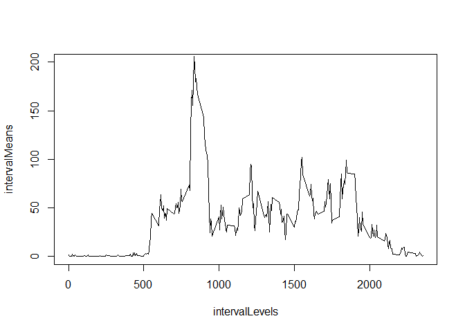
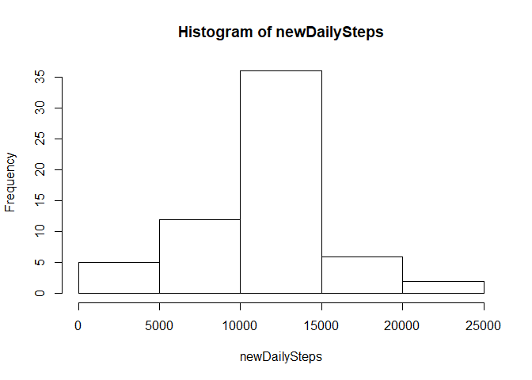
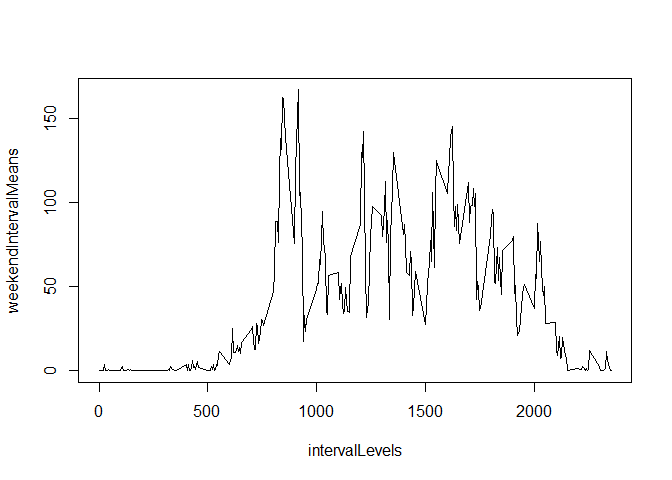

## Loading and preprocessing the data

Data is in same folder as Rmd file  
Changed name of data file to activityData.csv


```r
df <- read.csv('activityData.csv')
head(df)
```

```
##   steps       date interval
## 1    NA 2012-10-01        0
## 2    NA 2012-10-01        5
## 3    NA 2012-10-01       10
## 4    NA 2012-10-01       15
## 5    NA 2012-10-01       20
## 6    NA 2012-10-01       25
```

```r
tail(df)
```

```
##       steps       date interval
## 17563    NA 2012-11-30     2330
## 17564    NA 2012-11-30     2335
## 17565    NA 2012-11-30     2340
## 17566    NA 2012-11-30     2345
## 17567    NA 2012-11-30     2350
## 17568    NA 2012-11-30     2355
```

```r
dim(df)
```

```
## [1] 17568     3
```

So we have about 17500 observations to go through

## What is mean total number of steps taken per day?
For our first question, let's just analyze the rows that have values to get an answer for the mean.


```r
dfNoNA <- df[complete.cases(df),]
dim(dfNoNA)
```

```
## [1] 15264     3
```

So we have about 2000 rows with NA, surprising for the length of data available to us.  
Without these NA's, we can now get the average daily steps easily.


```r
dailySteps <- tapply(dfNoNA$steps, dfNoNA$date, sum)
mean(dailySteps)
```

```
## [1] NA
```

```r
median(dailySteps)
```

```
## <NA> 
##   NA
```

But we get an NA value for each!  

This happens because wew still have some NA values as seen below


```r
dailySteps[is.na(dailySteps)==TRUE]
```

```
## 2012-10-01 2012-10-08 2012-11-01 2012-11-04 2012-11-09 2012-11-10 
##         NA         NA         NA         NA         NA         NA 
## 2012-11-14 2012-11-30 
##         NA         NA
```

These dates aren't in our df with NA values removed, so let's remove them here too and try getting our mean and median again


```r
dailySteps <- dailySteps[is.na(dailySteps)==FALSE]
mean(dailySteps)
```

```
## [1] 10766.19
```

```r
median(dailySteps)
```

```
## [1] 10765
```

Now that we have our mean and median, let's get a histogram of the number of steps per day.


```r
hist(dailySteps)
```

<!-- -->

## What is the average daily activity pattern?

For the average daily activity pattern, there are two ways we can answer this question:  

- The first is by making a plot of the avg daily steps throughout the timeline of the data.
- The second is by getting the average number of steps by interval and plotting out an 'average day'  

Let's go ahead and do the second one for now, as that's what's required by our project.  


```r
intervalMeans <- tapply(dfNoNA$steps, dfNoNA$interval, mean)
meanTS <- ts(intervalMeans, start=c(1), end=c(288), frequency=1)

intervalLevels <- levels(as.factor(dfNoNA$interval))
plot(intervalLevels, intervalMeans, type='l', ylim = c(0, 200))
```

<!-- -->
And the max average steps occurs at :


```r
which.max(meanTS)
```

```
## 835 
## 104
```

and that time interval corresponds with the 1:55 - 2:00 P.M interval  
## Imputing missing values

First let's replace the NA's of each time interval with the mean for that interval


```r
dfReplaceNA <- df
dfReplaceNA$steps <- ifelse(is.na(dfReplaceNA$steps), intervalMeans, dfReplaceNA$steps)
sum(is.na(dfReplaceNA))
```

```
## [1] 0
```


Now let's get the histogram of each day's steps with all NA's replaced 


```r
newDailySteps <- tapply(dfReplaceNA$steps, dfReplaceNA$date, sum);

hist(newDailySteps)
```

<!-- -->

And let's get the new mean and median too


```r
mean(newDailySteps)
```

```
## [1] 10766.19
```

```r
median(newDailySteps)
```

```
## [1] 10766.19
```

The mean didn't change but the median became the mean, which makes sense because we replaced null values with the mean, right at the center.  

## Are there differences in activity patterns between weekdays and weekends?

First let's add a column for day of the week


```r
dfReplaceNA['weekday'] <- weekdays(as.Date(as.character(dfReplaceNA$date), '%Y-%m-%d'))

head(dfReplaceNA)
```

```
##       steps       date interval weekday
## 1 1.7169811 2012-10-01        0  Monday
## 2 0.3396226 2012-10-01        5  Monday
## 3 0.1320755 2012-10-01       10  Monday
## 4 0.1509434 2012-10-01       15  Monday
## 5 0.0754717 2012-10-01       20  Monday
## 6 2.0943396 2012-10-01       25  Monday
```

Now let's get a data frame with the weekdays, a dataframe with weekend days and get the 5 min interval means for each and plot them


```r
weekendDF <- subset(dfReplaceNA, weekday %in% c('Saturday', 'Sunday'))

weekdayDF <- subset(dfReplaceNA, weekday %in% c('Monday', 'Tuesday', 'Wednesday', 'Thursday', 'Friday'))
```


```r
weekdayIntervalMeans <- tapply(weekdayDF$steps, weekdayDF$interval, mean)
weekdayMeanTS <- ts(weekdayIntervalMeans, start=c(1), end=c(288), frequency=1)

intervalLevels <- levels(as.factor(weekdayDF$interval))
plot(intervalLevels, weekdayIntervalMeans, type='l')
```

<!-- -->

```r
weekendIntervalMeans <- tapply(weekendDF$steps, weekendDF$interval, mean)
weekendMeanTS <- ts(weekendIntervalMeans, start=c(1), end=c(288), frequency=1)

intervalLevels <- levels(as.factor(weekendDF$interval))
plot(intervalLevels, weekendIntervalMeans, type='l')
```

<!-- -->


