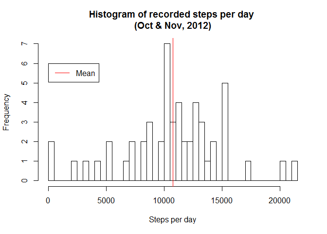
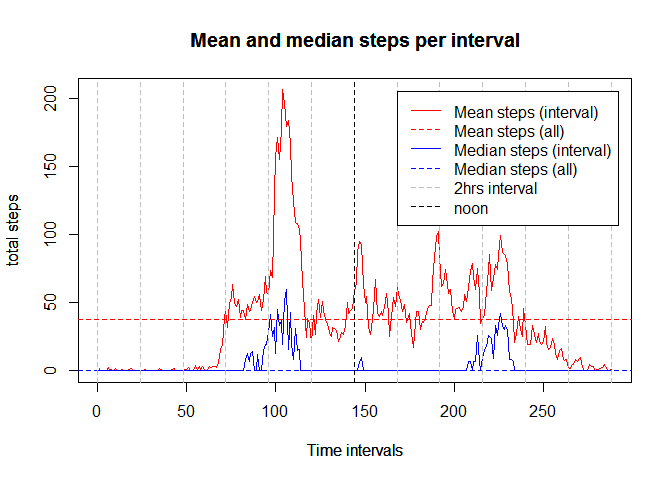
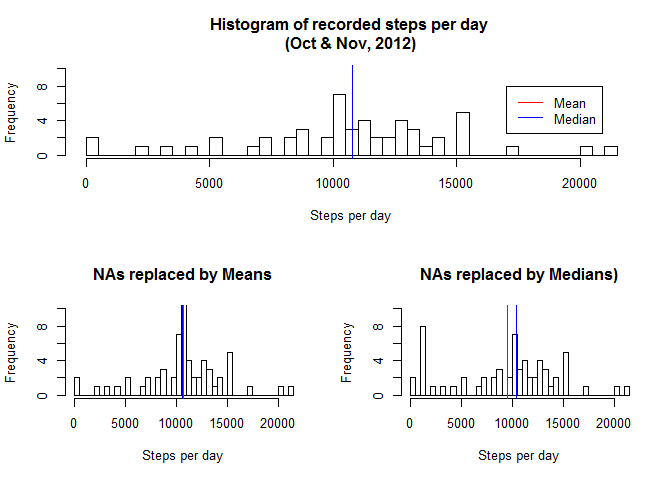
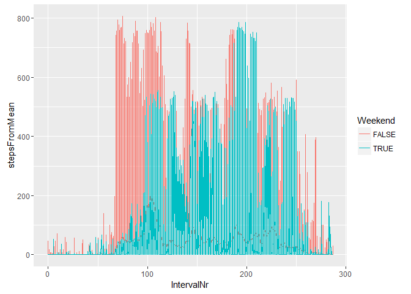

# RepData_Assignment1
Hannes Seller  
Sunday, February 07, 2016  
## Introduction 
This is an asssignment done for the Coursera course "Reproducible Research" in the "Data Science Specialization". The paper's purpose is to investigate a data set collected by monitoring devices.

The data consists of 17 568 entries showing how many steps have been taken in five minute intervals throughout two months (61 days with 288 entries each). The intervals are denoted like "905" standing for 9:05-9:10. As they are not continuous (e.g. 955 ... 1000), I will use the labels 1-288 (00:00 - 23:55) instead and will refer to the original interval name when needed.

## Loading and preprocessing the data
The following section loads the csv data into a data frame and deletes empty entries (NAs). From 17 568 rows, 15 264 entries are complete.


```r
setwd("~/GitHub/RepData_PeerAssessment1")
unzip("activity.zip")

data_raw <- read.csv("activity.csv", header=T, sep=",")
data <- data_raw[which(!is.na(data_raw$steps)),] #remove NAs
```

```r
nrow(data_raw) #  17 568
nrow(data)     #  15 264  
# 2 304 empty rows
```

## What is mean total number of steps taken per day?
In this section I calculate the total amount of steps for each individual day. Since only 53 out of 61 days have data, I only consider days with at least one step for the average. Mean and median are almost identical (10766), I will therefore only show the median in the graph.


```r
steps_sum <- tapply(data$steps, data$date, sum) 
steps_mean <- mean(steps_sum, na.rm=T)          # 10766
steps_median <- median(steps_sum, na.rm=T)      # 10765
```

```r
length(unique(data$date)) # 53 days with data
```

```r
hist(steps_sum, breaks=60,
     xlab="Steps per day",
     main="Histogram of recorded steps per day \n(Oct & Nov, 2012)")
abline(v=steps_mean, col="red")
legend(1,6, "Mean", lty = 1, col="red")
```

 

## What is the average daily activity pattern?
The following graph shows the average steps taken per 5 minute intervals across all days. The average (red lines) step number per interval is roughly 37, while the highest value is 206, which can be found in the interval 835 (8:35-8:40 a.m.) during the morning commuting hours. The respective median values (blue lines) are significantly lower due to the fact that more than half of the entries have zero steps (roughly 72 %). The highest median value is 60 at 8:45-8:50, ten minutes after the peak of mean values.  


```r
interval_mean <- tapply(data$steps, data$interval, mean)
interval_median <- tapply(data$steps, data$interval, median)
```

```r
mean(data$steps)   # 37.4 steps per interval
median(data$steps) # 0 steps per interval
max(interval_mean) # 206.2 steps per interval
max(interval_median) # 60 steps per interval

interval_mean[which(interval_mean == max(interval_mean))] # 835
interval_median[which(interval_median == max(interval_median))] # 845
nrow(data[which(data$steps==0),]) / nrow(data) # .72 ... 72 % of entries have 0 steps
```

```r
plot(tapply(data$steps, data$interval, mean), type="l", col="red",
     xlab="Time intervals", ylab="total steps", main="Mean and median steps per interval")

par(new=T)
plot(tapply(data$steps, data$interval, median), type="l", col="blue", 
     ylim=range(0:max(interval_mean)), axes=F,
     xlab="Time intervals", ylab="total steps", main="Mean and median steps per interval")

abline(h=mean(data$steps), col="red", lty=2)
abline(h=median(data$steps), col="blue", lty=2)
abline(v=seq(0,288, by= 24), lty=2, col="grey")
abline(v=144, lty=2, col="black")
legend(168,205, c("Mean steps (interval)", "Mean steps (all)", 
                  "Median steps (interval)", "Median steps (all)", 
                  "2hrs interval", "noon"), lty = c(1,2,1,2,2,2), 
       col=c("red", "red", "blue", "blue", "grey","black"))
```

 

## Imputing missing values
As reported earlier, 2 304 rows have a blank entry: NA (i.e. "not available"). NAs are different from zero steps as the latter legitimately decrease the mean and median values. To impute missing data I will assign to each NA the mean or median value of their respective intervals and compare the results to the original data. I also add a column with a logical value that indicates whether the entry was imputed (original = FALSE).

The graphs below show that both methods lead to different results of which both only have limited usefulness. Imputing missing values by mean values leads to a higher aggregation at the data's centre. Values imputed by medians, however, tend to be 0 (as described above) leading to more values at the lower tail of the graph.


```r
data_copy <- data_raw
data_copy$original <- T
data_copy$stepsFromMean <- data_copy$steps
data_copy$stepsFromMedian <- data_copy$steps

for(i in 1:nrow(data_copy))
  {
    if(is.na(data_copy$steps[i])) 
      {
        data_copy$original[i] <- F
        data_copy$stepsFromMean[i] <- floor(mean(data_copy$steps[which(data_copy$interval ==   data_copy$interval[i])], na.rm=T)) 
        data_copy$stepsFromMedian[i] <- median(data_copy$steps[which(data_copy$interval == data_copy$interval[i])], na.rm=T)
      }
  }

# Original data
steps_sum <- tapply(data$steps, data$date, sum) 
steps_mean <- mean(steps_sum, na.rm=T)          # 10766
steps_median <- median(steps_sum, na.rm=T)      # 10765

# Imputed data with Means
steps1_sum <- tapply(data_copy$stepsFromMean, data_copy$date, sum) 
steps1_mean <- mean(steps1_sum, na.rm=T)          # 10750
steps1_median <- median(steps1_sum, na.rm=T)      # 10641

# Imputed data with Medians
steps2_sum <- tapply(data_copy$stepsFromMedian, data_copy$date, sum) 
steps2_mean <- mean(steps2_sum, na.rm=T)          # 9504
steps2_median <- median(steps2_sum, na.rm=T)      # 10395

layout(matrix(c(1,1,2,3), 2, 2, byrow = TRUE))
hist(steps_sum, breaks=60, ylim=c(0,10),
     xlab="Steps per day",
     main="Histogram of recorded steps per day \n(Oct & Nov, 2012)")
abline(v=steps_mean, col="red")
abline(v=steps_median, col="blue")
legend(17000,8, c("Mean", "Median"), lty = c(1,1), col=c("red", "blue"))

hist(steps1_sum, breaks=60,
     xlab="Steps per day", ylim=c(0,10),
     main="NAs replaced by Means")
abline(v=steps1_mean, col="red")
abline(v=steps1_median, col="blue")

hist(steps2_sum, breaks=60,
     xlab="Steps per day", ylim=c(0,10),
     main="NAs replaced by Medians)")
abline(v=steps2_mean, col="red")
abline(v=steps2_median, col="blue")
```

 

## Are there differences in activity patterns between weekdays and weekends?
The following section shows differences between weekdays (red) and weekends (blue). The plot shows that the steps are usually shifted to later intervals because fewer people have to get to work early. However, an average weekend day has roughly 2 000 steps more than a working day.


```r
library(ggplot2)
```

```
## Warning: package 'ggplot2' was built under R version 3.1.3
```

```r
data_copy$Weekdays <- weekdays(as.Date(data_copy$date), abbreviate=T)
data_copy$Weekend <- F
data_copy$IntervalNr <- rep(seq(0,287,1),61)

for(i in 1:nrow(data_copy)) 
  {
    if(data_copy$Weekdays[i] == "Sa" | data_copy$Weekdays[i] == "So") 
      data_copy$Weekend[i] <- T
  }

sum(data_copy$stepsFromMean[which(data_copy$Weekend == T)]) / length(unique(data_copy$date[which(data_copy$Weekend==T)])) # steps weekend day
```

```
## [1] 12185.88
```

```r
sum(data_copy$stepsFromMean[which(data_copy$Weekend == F)]) / length(unique(data_copy$date[which(data_copy$Weekend==F)])) # steps weekend day
```

```
## [1] 10239.16
```

```r
ggplot(data=data_copy, aes(x=IntervalNr, y=stepsFromMean)) + geom_line(aes(group=Weekend, colour=Weekend)) 
```

 
