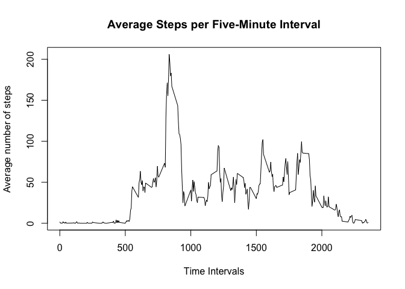
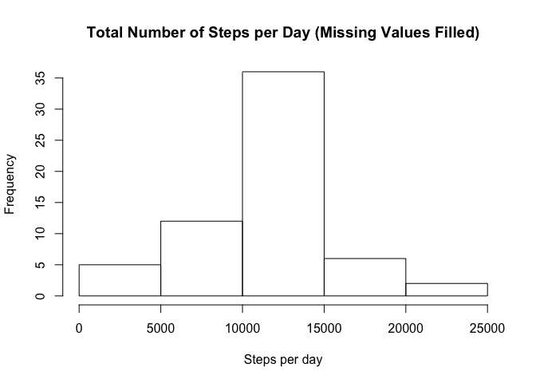
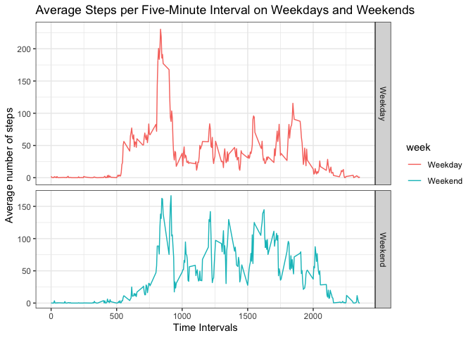

#Reproducible Research: Peer Assessment 1

## Loading and preprocessing the data

### 1. Load the data (e.g. read.csv())


```r
# First, use setwd() to the right folder. I skipped this step here since different people store the file at different places.

# Second, unzip the file to obtain the csv file. Although Mac will automatically unzip the file upon downloading finish. I'll still do this step in case other plateforms do not have this.

if (!file.exists("activity.csv")){
    unzip ("activity.zip")
}
AllData <- read.csv("activity.csv")   
```

### 2. Process/transform the data (if necessary) into a format suitable for your analysis


```r
# Third, remove all incomplet cases to tidy the data
CompleteData <- AllData[complete.cases(AllData),]
```

## What is mean total number of steps taken per day?

### 1. Calculate the total number of steps taken per day


```r
# We will use the aggregate function to calculate all steps listed.
Total_Steps_Per_Day <- aggregate(steps ~ date, CompleteData, sum)
```

### 2. If you do not understand the difference between a histogram and a barplot, research the difference between them. Make a histogram of the total number of steps taken each day


```r
# We will create a histal gram showing the steps per day. Here, we will use standard breaks since it is not required.
hist(Total_Steps_Per_Day$steps, main = "Total Number of Steps per Day", xlab = "Steps per day")
```

<!-- -->


### 3. Calculate and report the mean and median of the total number of steps taken per day


```r
# We will calculate the mean and the media seperately.
# First, the mean. Note that we will round it to the nearest integer
Mean_Steps_Per_Day <- round(mean(Total_Steps_Per_Day$steps))

# Second, the median
Median_Steps_Per_Day <- median(Total_Steps_Per_Day$steps)

# Lastly, print out the data
print(paste("The mean steps per day is", Mean_Steps_Per_Day, 
            "and the median steps per day is", Median_Steps_Per_Day, 
            "(rounded to the nearest integer)"))
```

```
## [1] "The mean steps per day is 10766 and the median steps per day is 10765 (rounded to the nearest integer)"
```

## What is the average daily activity pattern?
### 1. Make a time series plot (i.e. type = "l") of the 5-minute interval (x-axis) and the average number of steps taken, averaged across all days (y-axis)


```r
# First, we need to calulate the average steps per 5-min interval:
Avg_Steps_per_Interval <- aggregate(steps ~ interval,CompleteData, mean)

# Second, generate the time serises plot.
plot(Avg_Steps_per_Interval$interval, Avg_Steps_per_Interval$steps, type = "l",
     main = "Average Steps per Five-Minute Interval", 
     xlab = "Time Intervals", ylab = "Average number of steps")
```

<!-- -->

### 2. Which 5-minute interval, on average across all the days in the dataset, contains the maximum number of steps?


```r
# To do this, we need to find out the intervel index at which the highest steps appears and print it out.
# Note that the steps are ronded to the nearest integer.
StepMax <- which.max(Avg_Steps_per_Interval$steps)

print(paste("At interval", Avg_Steps_per_Interval[StepMax,]$interval, 
            "the highest steps appear, which is",
            round(Avg_Steps_per_Interval[StepMax,]$steps, digits = 0),
            "steps (rounded to the nearest integer)"))
```

```
## [1] "At interval 835 the highest steps appear, which is 206 steps (rounded to the nearest integer)"
```

## Imputing missing values

### 1. Calculate and report the total number of missing values in the dataset (i.e. the total number of rows with NAs)


```r
# To do this, we need to find out the number of missing values and print it out.
# Two ways to do it. One is Total - Complete, the other way is find "is.na" positive.

MissingData <- AllData[is.na(AllData$steps),]
MissingNumber <- length(MissingData$steps)

print(paste("The number is missing values is", MissingNumber))
```

```
## [1] "The number is missing values is 2304"
```

### 2. Devise a strategy for filling in all of the missing values in the dataset. The strategy does not need to be sophisticated. For example, you could use the mean/median for that day, or the mean for that 5-minute interval, etc.


```r
# To make things easy, I'll use the mean steps per day to replace the missing values.
Fill_Missing_Data <- MissingData
Fill_Missing_Steps <- with (CompleteData, tapply(steps, CompleteData$interval, mean))
Fill_Missing_Data$steps <- Fill_Missing_Steps
```


### 3. Create a new dataset that is equal to the original dataset but with the missing data filled in.


```r
# Now, we will use rbind to merge the generaed missing values with the original to make the new dataset

NewData <- rbind(CompleteData, Fill_Missing_Data)
NewData <- NewData[order(NewData$date),]
```


### 4. Make a histogram of the total number of steps taken each day and Calculate and report the mean and median total number of steps taken per day. Do these values differ from the estimates from the first part of the assignment? What is the impact of imputing missing data on the estimates of the total daily number of steps?


```r
# First, we will generate the histoplot using the same settings.
New_Total_Steps_Per_Day <- aggregate(steps ~ date, NewData, sum)
hist(New_Total_Steps_Per_Day$steps, xlab = "Steps per day",
     main = "Total Number of Steps per Day (Missing Values Filled)")
```

<!-- -->


```r
# Then, calculate the mean and the median.
New_Mean_Steps_Per_Day <- round(mean(New_Total_Steps_Per_Day$steps))
New_Median_Steps_Per_Day <- round(median(New_Total_Steps_Per_Day$steps))

# Finally, print out the data and the conlcusion.
print(paste("After filling the misssing values, the mean steps per day is",
            New_Mean_Steps_Per_Day, "and the median steps per day is", 
            New_Median_Steps_Per_Day, "(rounded to the nearest integer)"))
```

```
## [1] "After filling the misssing values, the mean steps per day is 10766 and the median steps per day is 10766 (rounded to the nearest integer)"
```

```r
print("By comparasion, the new Mean and Median are the same as the previous ones. This is because we used the mean from the rest of the dataset, causing limited impact of imputing missing data on the estimates of the total daily number of steps.")
```

```
## [1] "By comparasion, the new Mean and Median are the same as the previous ones. This is because we used the mean from the rest of the dataset, causing limited impact of imputing missing data on the estimates of the total daily number of steps."
```

## Are there differences in activity patterns between weekdays and weekends?

### 1. Create a new factor variable in the dataset with two levels – “weekday” and “weekend” indicating whether a given date is a weekday or weekend day.


```r
# To do this, we will generate a new function to decide the date
WeekDayEnd <- function (date_select){
    weekday <- weekdays(as.Date(date_select, "%Y-%m-%d"))
    if (!(weekday == "Saturday" || weekday == "Sunday")){
        x <- "Weekday"
    } else {
        x <- "Weekend"
    }
    x
}

# Then, we will rearrange the date section in our NewData dataset.
Update_NewData <- NewData
Update_NewData$week <- as.factor(sapply(Update_NewData$date, WeekDayEnd))
```

### 2. Make a panel plot containing a time series plot (i.e. type = "l") of the 5-minute interval (x-axis) and the average number of steps taken, averaged across all weekday days or weekend days (y-axis). See the README file in the GitHub repository to see an example of what this plot should look like using simulated data.


```r
# First, we will generate the histoplot using the same settings.
New_Avg_Steps_per_Interval <- aggregate(steps ~ interval + week, 
                                        Update_NewData, mean)

# Second, generate the time serises plot. To make things easier, we use ggplot2 instead of base plot this time.
library (ggplot2)
ggplot(New_Avg_Steps_per_Interval, aes(interval, steps)) +
    geom_line(stat ="identity", aes(col = week)) +
    theme_bw()+ facet_grid(week ~ ., scales = "free", space = "free") +
    xlab("Time Intervals") + ylab("Average number of steps") +
    ggtitle("Average Steps per Five-Minute Interval on Weekdays and Weekends")
```

<!-- -->
